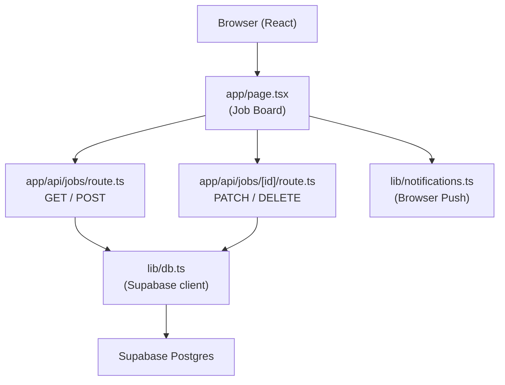

# CMS Job Tracker — Design Document

## Overview

The CMS Job Tracker is a lightweight internal queue management tool for an advertising agency's CMS team. It sits alongside Workbook (the agency's existing project management system) and solves the gap Workbook doesn't address: real-time queue visibility, priority management, and instant P1 escalation.

The core design philosophy is **clarity over features**. The dev should never have to ask "what do I work on next?" and a PM should be able to raise a fire alarm in under 20 seconds. Every design decision flows from these two goals.

The app is a single-page board with three zones, a persistent stats strip, and two slide-in creation panels. It is not a full project management suite — it is a focused queue tool.

### Key Design Decisions

- **No auth for MVP**: Role is selected via a simple session-persistent toggle (AM/Dev). Full Supabase Auth is a post-MVP concern. This keeps the MVP fast to build and deploy.
- **Supabase JS client over postgres.js**: The `@supabase/supabase-js` client is serverless-safe by design — it uses HTTP under the hood and has no persistent connection pool, which avoids the connection exhaustion issues postgres.js causes on Vercel's serverless functions. It's the official Supabase SDK, requires no connection string management, and works out of the box on Vercel with zero configuration.
- **Three-zone board over kanban columns**: The zones map directly to the three mental states of work — "not ready", "ready/in-flight", "done". Kanban columns would require horizontal scrolling and obscure the priority ordering.
- **Browser push notifications over Slack/email**: Zero integration complexity, works immediately, sufficient for a small co-located team.

---

## Architecture

The app follows Next.js 14 App Router conventions with a clear separation between the React UI layer and the API layer.



### Data Flow

1. On page load, `app/page.tsx` fetches all active jobs via `GET /api/jobs`
2. Jobs are distributed into three zones by their `status` field
3. User actions (create job, change status) call the relevant API route
4. API routes validate business rules (Workbook link gate, WIP cap check) and write to Supabase
5. On success, the UI re-fetches or optimistically updates the local state
6. P1 creation triggers a browser push notification via `lib/notifications.ts`

### State Management

No external state library. React `useState` + `useEffect` with fetch-on-mutation is sufficient for this scale. The board re-fetches after every mutation to stay in sync across users (polling or manual refresh — realtime is post-MVP).

---

## Components and Interfaces

### Component Tree

```
app/page.tsx
├── Header
│   ├── Logo / App name
│   └── FireAlarmPanel (Sheet trigger — "🔴 Raise Urgent")
├── StatsStrip
│   ├── StatCounter (×6)
│   └── WIPWarningBanner (conditional)
├── FilterBar
│   ├── FilterTabs
│   └── SearchInput
├── JobBoard
│   ├── NeedsInfoZone (AM role only)
│   │   └── JobCard (×n)
│   ├── ActiveQueueZone
│   │   └── JobCard (×n)
│   └── DoneThisWeekZone (collapsible)
│       └── JobCard (×n)
├── NewJobPanel (Sheet — standard creation)
└── FireAlarmPanel (Sheet — P1 fast-track)
```

### Component Interfaces

```typescript
// JobCard
interface JobCardProps {
  job: Job
  role: 'am' | 'dev'
  onStatusChange: (jobId: string, newStatus: JobStatus) => Promise<void>
  onWorkbookLinkAdd: (jobId: string, link: string) => Promise<void>
}

// StatsStrip
interface StatsStripProps {
  stats: {
    totalActive: number
    inProgress: number
    blocked: number
    overdue: number
    completedThisWeek: number
    p1sThisWeek: number
  }
  wipCapExceeded: boolean
}

// NewJobPanel
interface NewJobPanelProps {
  open: boolean
  onOpenChange: (open: boolean) => void
  onSubmit: (job: CreateJobPayload) => Promise<void>
  defaultAm?: string
}

// FireAlarmPanel
interface FireAlarmPanelProps {
  open: boolean
  onOpenChange: (open: boolean) => void
  onSubmit: (job: FireAlarmPayload) => Promise<void>
}

// WorkbookButton
interface WorkbookButtonProps {
  link: string | null
  jobId: string
  onLinkAdd: (jobId: string, link: string) => Promise<void>
}
```

### API Routes

```
GET  /api/jobs
  → Returns all non-live jobs ordered by priority (p1 first) then created_at ASC
  → Query param: ?include_done=true to include live jobs from this week

POST /api/jobs
  Body: CreateJobPayload
  → Validates required fields
  → Determines initial status: 'briefed' if workbook_link present AND assets=true, else 'needs-info'
  → For fire alarm: always 'briefed', is_fire_alarm=true
  → Returns created Job row

PATCH /api/jobs/[id]
  Body: { status?: JobStatus, workbook_link?: string, ... }
  → Validates status transition is legal (sequential, no skipping)
  → Blocks transition to 'live' if workbook_link is null
  → Sets completed_at when status = 'live'
  → Returns updated Job row

DELETE /api/jobs/[id]
  → Soft delete or hard delete (MVP: hard delete)
```

---

## Data Models

### Job (TypeScript)

```typescript
interface Job {
  id: string
  title: string
  client: string
  brief: string | null
  type: JobType
  priority: 'p1' | 'p2' | 'p3'
  status: JobStatus
  am: string
  due_date: string | null       // ISO date string
  assets: boolean
  asset_notes: string | null
  workbook_link: string | null  // must start with https://wb.ogilvy.co.za#
  is_fire_alarm: boolean
  created_at: string
  updated_at: string
  completed_at: string | null
}

type JobStatus =
  | 'needs-info'
  | 'briefed'
  | 'in-progress'
  | 'awaiting-assets'
  | 'in-review'
  | 'awaiting-approval'
  | 'live'

type JobType =
  | 'Content update'
  | 'HTML emailer'
  | 'Bug fix'
  | 'Urgent fix'
  | 'New asset upload'
  | 'Campaign page'
  | 'Copy change'
  | 'Other'
```

### Create Payloads

```typescript
interface CreateJobPayload {
  title: string
  client: string
  brief?: string
  type: JobType
  priority: 'p1' | 'p2' | 'p3'
  workbook_link?: string
  due_date?: string
  assets: boolean
  asset_notes?: string
  am: string
}

interface FireAlarmPayload {
  title: string       // "what's broken / the ask"
  client: string
  workbook_link?: string
  // priority locked to p1, type locked to 'Urgent fix', is_fire_alarm=true
}
```

### Status Transition Map

The valid transitions are strictly sequential. The `awaiting-assets` status is a lateral hold that remembers the previous status for return.

```typescript
const VALID_TRANSITIONS: Record<JobStatus, JobStatus[]> = {
  'needs-info':        ['briefed'],
  'briefed':           ['in-progress', 'awaiting-assets'],
  'in-progress':       ['in-review', 'awaiting-assets'],
  'awaiting-assets':   ['briefed', 'in-progress', 'in-review'],  // returns to previous
  'in-review':         ['awaiting-approval', 'awaiting-assets'],
  'awaiting-approval': ['live'],
  'live':              [],
}
```

### Priority Sort Order

```typescript
const PRIORITY_ORDER = { p1: 0, p2: 1, p3: 2 }

// Sort: priority ASC, then due_date ASC (nulls last), then created_at ASC
function sortJobs(jobs: Job[]): Job[] {
  return [...jobs].sort((a, b) => {
    const pDiff = PRIORITY_ORDER[a.priority] - PRIORITY_ORDER[b.priority]
    if (pDiff !== 0) return pDiff
    if (a.due_date && b.due_date) return a.due_date.localeCompare(b.due_date)
    if (a.due_date) return -1
    if (b.due_date) return 1
    return a.created_at.localeCompare(b.created_at)
  })
}
```

### Zone Assignment

```typescript
function assignZone(job: Job): 'needs-info' | 'active' | 'done' {
  if (job.status === 'needs-info') return 'needs-info'
  if (job.status === 'live') return 'done'
  return 'active'
}
```

### Workbook Link Validation

```typescript
const WORKBOOK_LINK_PREFIX = 'https://wb.ogilvy.co.za#'

function isValidWorkbookLink(link: string): boolean {
  return link.startsWith(WORKBOOK_LINK_PREFIX) && link.length > WORKBOOK_LINK_PREFIX.length
}
```

### Needs Info Gate Logic

A job can transition from `needs-info` to `briefed` only when all of the following are true:

```typescript
function isReadyForQueue(job: Job): boolean {
  const hasWorkbookLink = job.workbook_link !== null && isValidWorkbookLink(job.workbook_link)
  const hasJobType = job.type !== null
  const hasDueDateIfP1 = job.priority !== 'p1' || job.due_date !== null
  return hasWorkbookLink && hasJobType && hasDueDateIfP1
}
```

---

## Correctness Properties

*A property is a characteristic or behavior that should hold true across all valid executions of a system — essentially, a formal statement about what the system should do. Properties serve as the bridge between human-readable specifications and machine-verifiable correctness guarantees.*

### Property 1: Priority ordering invariant

*For any* list of jobs, after sorting, all P1 jobs appear before all P2 jobs, and all P2 jobs appear before all P3 jobs.

**Validates: Requirements 4.1 (Priority ordering)**

### Property 2: Within-priority due date ordering

*For any* list of jobs with the same priority, after sorting, jobs with a due date appear before jobs without a due date, and jobs with earlier due dates appear before jobs with later due dates.

**Validates: Requirements 4.1 (Priority ordering)**

### Property 3: Workbook link gate blocks Live transition

*For any* job where `workbook_link` is null or invalid, attempting to transition its status to `live` must be rejected and the job's status must remain unchanged.

**Validates: Requirements 4.6 (Workbook Link Gate)**

### Property 4: Needs Info gate correctness

*For any* job, `isReadyForQueue` returns true if and only if the job has a valid Workbook link, a job type set, and (if P1) a due date set.

**Validates: Requirements 4.2 (Standard Job Creation), 2 (Needs Info gate)**

### Property 5: Fire alarm jobs bypass Needs Info gate

*For any* fire alarm job created via the fast-track form, the initial status must be `briefed` regardless of whether a Workbook link is present.

**Validates: Requirements 4.3 (P1 Fire Alarm Creation)**

### Property 6: Status transition validity

*For any* job and any attempted status transition, the transition is accepted if and only if the target status appears in the valid transitions map for the current status.

**Validates: Requirements 4.5 (Status Transitions)**

### Property 7: Workbook link validation

*For any* string, `isValidWorkbookLink` returns true if and only if the string starts with `https://wb.ogilvy.co.za#` and has at least one character after the `#`.

**Validates: Requirements 4.2 (Workbook link field validation)**

### Property 8: Zone assignment completeness

*For any* job, `assignZone` returns exactly one of `needs-info`, `active`, or `done` — never throws, never returns undefined.

**Validates: Requirements 4.1 (Three zones)**

### Property 9: Stats strip accuracy

*For any* list of jobs, the computed stats (inProgress count, blocked count, overdue count) exactly match the count of jobs with the corresponding status/condition in the list.

**Validates: Requirements 4.8 (Stats Strip)**

---

## Error Handling

### API Layer

| Scenario | HTTP Status | Response |
|----------|-------------|----------|
| Missing required field on POST | 400 | `{ error: "Field X is required" }` |
| Invalid Workbook link format | 400 | `{ error: "Workbook link must start with https://wb.ogilvy.co.za#" }` |
| Attempt to mark Live without Workbook link | 400 | `{ error: "Add the Workbook job link before marking this live" }` |
| Invalid status transition | 400 | `{ error: "Cannot transition from X to Y" }` |
| Job not found | 404 | `{ error: "Job not found" }` |
| Database error | 500 | `{ error: "Internal server error" }` |

### Client Layer

- **WIP cap exceeded**: Non-blocking warning banner — the system warns but does not hard-block (the dev may need to start a P1 regardless)
- **Workbook link missing on Live attempt**: Inline error on the card action button, not a toast — the error must be visible at the point of action
- **Network error on mutation**: Toast notification with retry option; optimistic updates are rolled back
- **Browser notification permission denied**: Silent fallback — in-app P1 pulse indicator is the primary signal, push notification is secondary

### Validation Rules Summary

```typescript
// POST /api/jobs validation
const standardJobRules = {
  title: required,
  client: required,
  type: required,
  priority: required,
  am: required,
  assets: required,
  workbook_link: optional_but_validated_if_present,
  due_date: required_if_priority_is_p1,
  asset_notes: required_if_assets_is_false,
}

const fireAlarmRules = {
  title: required,
  client: required,
  // workbook_link: optional, no validation at creation
}
```

---

## Testing Strategy

This feature involves a mix of pure business logic functions (sorting, validation, zone assignment, transition rules) and UI/API integration. PBT is appropriate for the pure logic layer.

### Property-Based Testing

Use **fast-check** (TypeScript-native PBT library) for all correctness properties.

Each property test runs a minimum of 100 iterations with randomly generated inputs.

```typescript
// Example: Property 1 — Priority ordering invariant
// Feature: cms-job-tracker, Property 1: Priority ordering invariant
it('P1 jobs always appear before P2 and P2 before P3 after sort', () => {
  fc.assert(fc.property(
    fc.array(arbitraryJob()),
    (jobs) => {
      const sorted = sortJobs(jobs)
      for (let i = 0; i < sorted.length - 1; i++) {
        expect(PRIORITY_ORDER[sorted[i].priority])
          .toBeLessThanOrEqual(PRIORITY_ORDER[sorted[i + 1].priority])
      }
    }
  ), { numRuns: 100 })
})
```

Properties to implement as PBT:
- Property 1: Priority ordering invariant
- Property 2: Within-priority due date ordering
- Property 3: Workbook link gate blocks Live transition
- Property 4: Needs Info gate correctness
- Property 5: Fire alarm jobs bypass Needs Info gate
- Property 6: Status transition validity
- Property 7: Workbook link validation
- Property 8: Zone assignment completeness
- Property 9: Stats strip accuracy

### Unit Tests (Example-Based)

Focus on specific scenarios and edge cases not covered by PBT:

- Standard job creation form: valid submission routes to `briefed`
- Standard job creation form: missing Workbook link routes to `needs-info`
- Fire alarm form: submission always routes to `briefed` with `is_fire_alarm=true`
- API route: `PATCH /api/jobs/[id]` with `status=live` and no `workbook_link` returns 400
- API route: `GET /api/jobs` returns jobs ordered correctly
- `isValidWorkbookLink`: empty string returns false
- `isValidWorkbookLink`: link with only the prefix (no hash content) returns false
- `isReadyForQueue`: P1 job without due date returns false
- `isReadyForQueue`: P2 job without due date returns true

### Integration Tests

- `GET /api/jobs` returns correct shape from real DB (or test DB)
- `POST /api/jobs` inserts and returns the created row
- `PATCH /api/jobs/[id]` updates status and `updated_at`
- `PATCH /api/jobs/[id]` with `status=live` and no link returns 400

### UI / Component Tests

Use Vitest + React Testing Library for component-level tests:

- `JobCard` renders P1 pulse animation when `priority=p1` and `status=briefed`
- `JobCard` renders amber banner when `is_fire_alarm=true` and `workbook_link=null`
- `JobCard` renders "Open in Workbook ↗" button when `workbook_link` is present
- `JobCard` renders "Add Workbook link" prompt when `workbook_link` is null
- `StatsStrip` renders WIP warning banner when `wipCapExceeded=true`
- `NeedsInfoZone` is not rendered when `role=dev`
- `FilterBar` search filters jobs by title and client name
